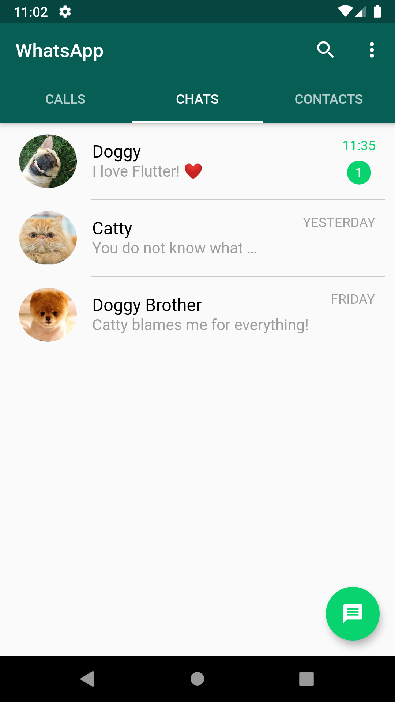

# WhatsApp UI clone on Flutter

In [this post](https://medium.com/@castellano.mariano/whatsapp-ui-clone-7f75773ad21b?sk=ffb2ccec0f945eac4d50ea306ce646c0) i'm going to show you how to copy WhatsApp UI chats view on Android. 

*NOTE*: this post will be fully UI, we won't any code for business classes.
At the end, we will see the following image:

